# Sección 1: Los cimientos — Por qué la arquitectura importa

Guía de referencia para el equipo. Resume el contenido de las 13 clases de la sección, con el código real del proyecto **atlas-bank**, las capturas de pantalla y los slides de cada clase. Sirve como material de consulta para quien no vio la clase en vivo o quiera repasar un concepto puntual.

## Qué vas a encontrar

- Principios **SOLID** aplicados con criterio (no como dogma)
- Inyección de dependencias: constructor injection, `@Qualifier`, `@Primary`
- Evolución real de un CRUD sin arquitectura hacia un proyecto organizado
- Package-by-layer vs package-by-feature
- El proyecto **atlas-bank**: cuentas, transferencias, comisiones

El proyecto vive en [`/proyecto`](../proyecto) y evoluciona clase a clase. Cada clase de esta carpeta (`clase_1` … `clase_13`) contiene el slide (`.html`), capturas de pantalla y/o fragmentos de código de ese momento del curso.

---

## Clase 1 — Los objetivos: aprendizaje y proyecto

Slide: [`clase_1/slides-clase-02.html`](clase_1/slides-clase-02.html)

Introducción al curso completo (no solo a esta sección):

- Principios SOLID aplicados con criterio
- 11 patrones de diseño implementados
- Domain-Driven Design táctico
- Arquitectura Hexagonal completa
- CQRS liviano
- Testing arquitectónico con ArchUnit
- AI Agent como cliente de la arquitectura

Proyecto guía: **atlas-bank**, un sistema bancario simplificado (cuentas, transferencias, comisiones, seguridad con Keycloak). Cada patrón se justifica con un caso real y el proyecto evoluciona clase a clase — no se reescribe de cero.

Requisitos: Spring Boot a nivel CRUD (controllers, JPA, REST) y Java básico/intermedio. No hace falta saber arquitectura, DDD ni patrones de antemano.

> "Tu código no solo tiene que funcionar — tiene que poder crecer, cambiar y sobrevivir."

---

## Clase 2 — El costo del código sin arquitectura

Slide: [`clase_2/slides-clase-03.html`](clase_2/slides-clase-03.html)

> "Todos los proyectos arrancan bien. El problema es cuando crecen."

El proyecto típico de Spring Boot sin criterio:

- Controller → Service → Repository, y el Service **hace todo**
- La Entity sale directo al controller (sin DTO)
- Sin manejo de errores estructurado (`RuntimeException` para todo)
- Sin validación centralizada
- "Funciona" hasta que crece — ese es el "God Service"

Lo que se va a construir a lo largo del curso para resolverlo:

| Problema | Solución |
|---|---|
| God Service | Services cohesivos con SRP |
| Entity expuesta | DTOs + mapeo |
| `RuntimeException` genérica | `ProblemDetail` + RFC 7807 |
| Comisión hardcodeada | Strategy Pattern |
| Todo acoplado | Arquitectura Hexagonal |
| Sin tests de estructura | ArchUnit |

---

## Clase 3 — Setup del proyecto base (parte 1 y 2)

Setup de **atlas-bank** con Spring Initializr, dependencias (Web, JPA, H2, Lombok) y verificación de la consola H2.

| Spring Initializr | Arranque H2 | Consola H2 |
|---|---|---|
| 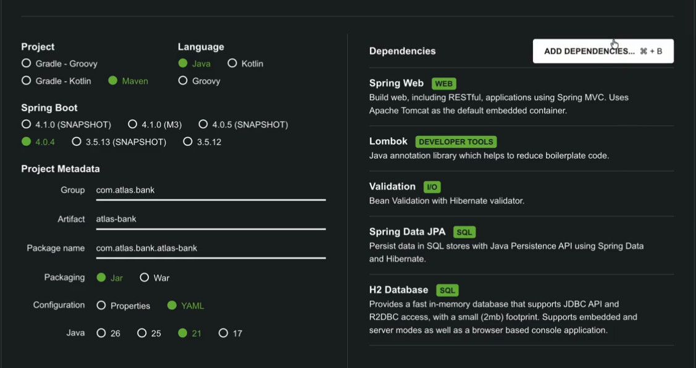 | 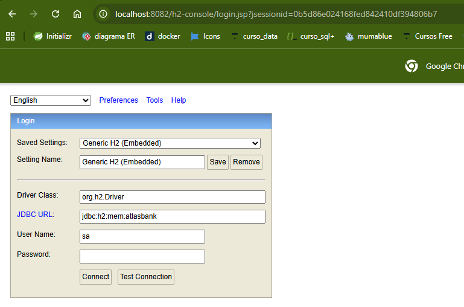 | 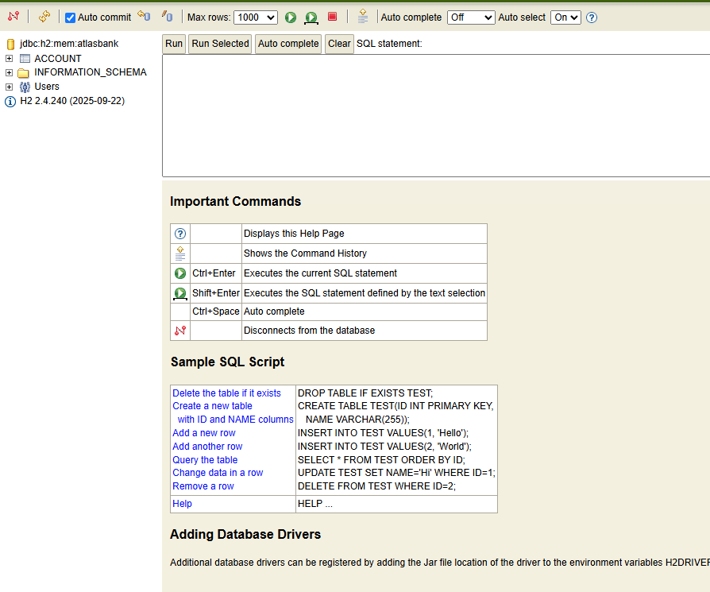 |

Proyecto base descargado: [`clase_3/atlas-bank.zip`](clase_3/atlas-bank.zip)

---

## Clase 4 — Conectando las capas del proyecto (parte 1 y 2)

Primer CRUD funcional, todo en un único paquete plano (`com.atlas.bank`), sin separación por capas ni por feature. Es el punto de partida "sin arquitectura" que se referencia en toda la sección.

**`AccountService`** — un único service hace de todo: alta de cuentas, consulta, y la lógica completa de transferencia (búsqueda de cuentas, validación de estado, validación de fondos, cálculo de comisión hardcodeado con `if/else`, actualización de saldos y registro de la transacción):

```java
// clase_4/AccountService.java
@Service
@RequiredArgsConstructor
public class AccountService {

    private final AccountRepository accountRepository;
    private final TransactionRepository transactionRepository;

    public Account create(Account account) { return accountRepository.save(account); }
    public List<Account> findAll() { return accountRepository.findAll(); }
    public Account findById(Long id) {
        return accountRepository.findById(id)
                .orElseThrow(() -> new RuntimeException("Cuenta no encontrada"));
    }

    @Transactional
    public Transaction transfer(Long fromId, Long toId, BigDecimal amount) {
        Account from = accountRepository.findById(fromId)
                .orElseThrow(() -> new RuntimeException("Cuenta origen no encontrada"));
        Account to = accountRepository.findById(toId)
                .orElseThrow(() -> new RuntimeException("Cuenta destino no encontrada"));

        if (!"ACTIVE".equals(from.getStatus())) throw new RuntimeException("La cuenta origen no está activa");
        if (!"ACTIVE".equals(to.getStatus())) throw new RuntimeException("La cuenta destino no está activa");
        if (from.getBalance().compareTo(amount) < 0) throw new RuntimeException("Fondos insuficientes");

        // Calcular comisión — hardcodeada
        BigDecimal fee;
        if ("SAVINGS".equals(from.getType())) {
            fee = amount.multiply(new BigDecimal("0.01"));
        } else if ("CHECKING".equals(from.getType())) {
            fee = amount.multiply(new BigDecimal("0.015"));
        } else {
            fee = BigDecimal.ZERO;
        }

        from.setBalance(from.getBalance().subtract(amount).subtract(fee));
        to.setBalance(to.getBalance().add(amount));
        accountRepository.save(from);
        accountRepository.save(to);

        Transaction transaction = new Transaction();
        transaction.setType("TRANSFER");
        transaction.setSourceAccountId(fromId);
        transaction.setTargetAccountId(toId);
        transaction.setAmount(amount);
        transaction.setFee(fee);
        transaction.setStatus("EXECUTED");

        return transactionRepository.save(transaction);
    }

    public List<Transaction> getTransactions(Long accountId) {
        return transactionRepository.findBySourceAccountIdOrTargetAccountId(accountId, accountId);
    }
}
```

Este es exactamente el "God Service" que la Clase 2 describe como problema y que las clases 6, 7 y 10 van a desarmar.

Flujo probado manualmente contra la API:

| Crear cuenta | Crear cuenta 2 | Ver cuentas |
|---|---|---|
| 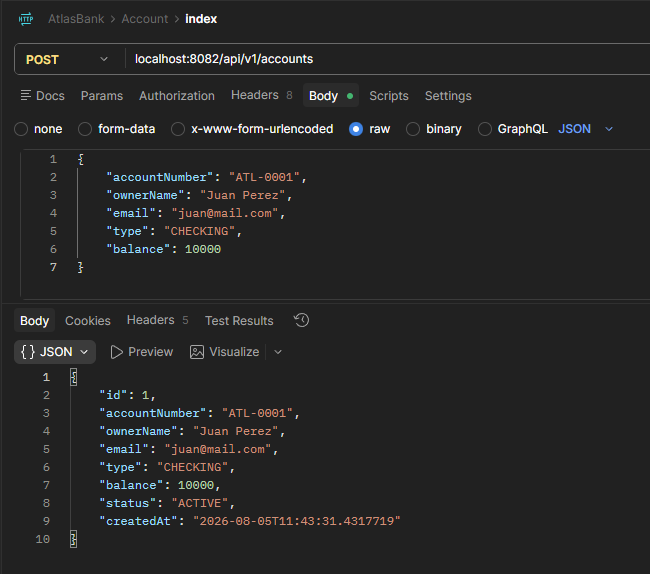 | 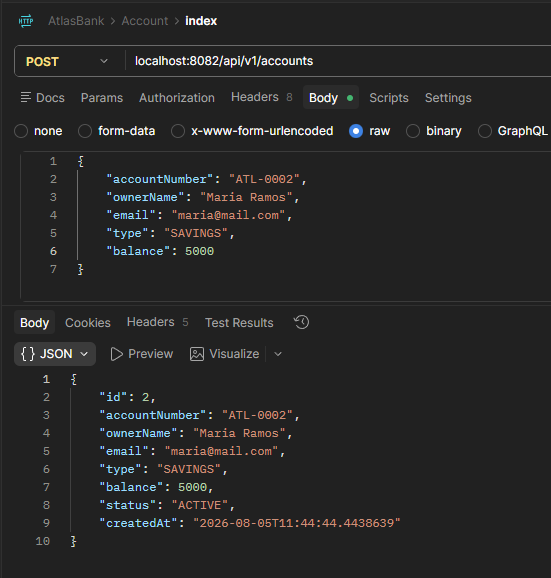 | 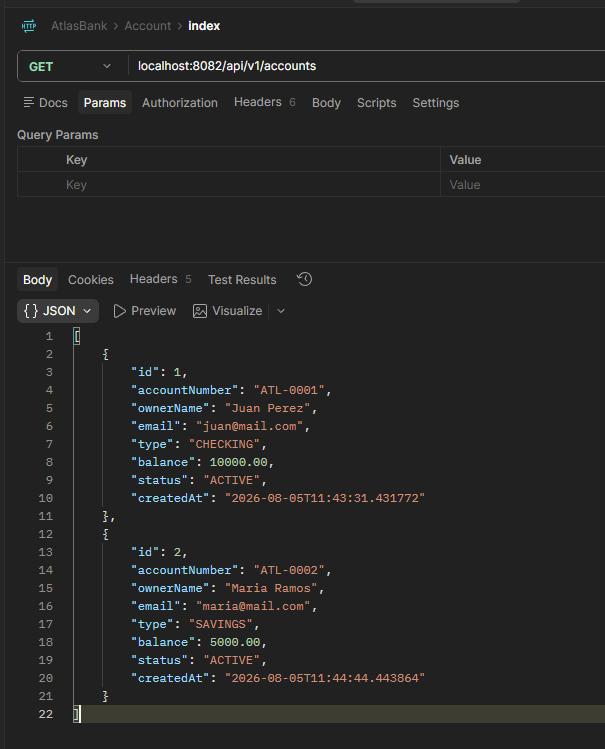 |

| Transferencia | Ver cuenta origen | Ver cuenta destino |
|---|---|---|
| 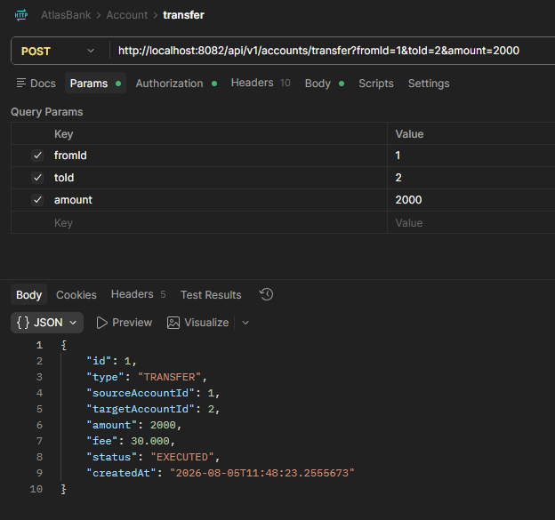 | 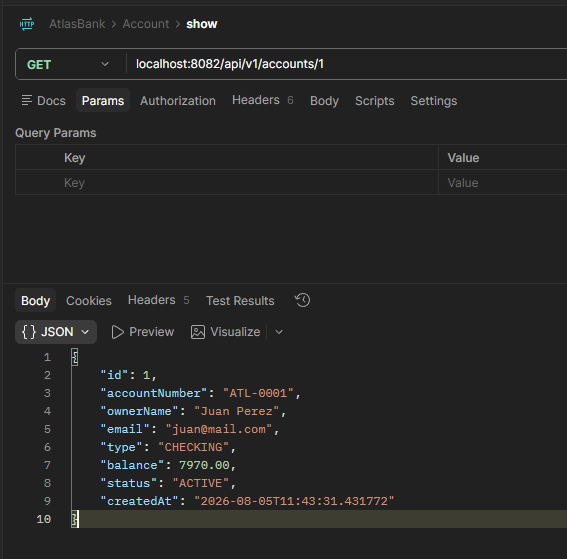 | 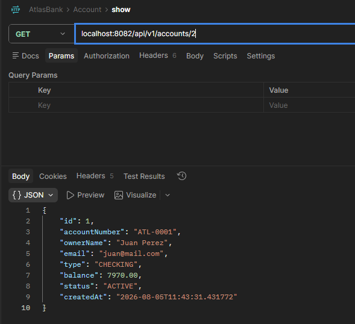 |

| Error de transferencia (fondos insuficientes / cuenta inactiva) | Traza del error en consola |
|---|---|
| 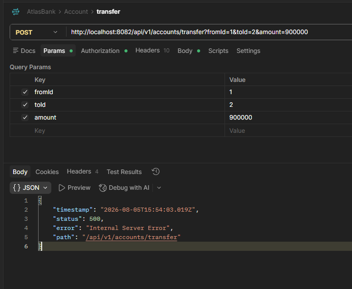 | 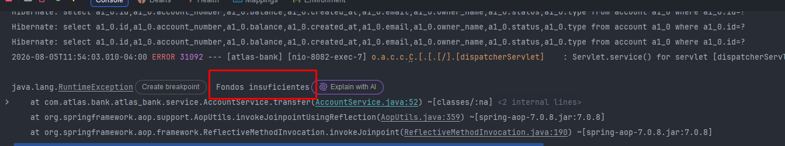 |

El error de la última captura es justamente el `RuntimeException` genérico que la Clase 2 marca como falta de manejo de errores estructurado — se resuelve más adelante en la Sección 2 con `ProblemDetail`.

---

## Clase 5 — Principios SOLID

Slide: [`clase_5/slides-clase-06.html`](clase_5/slides-clase-06.html)

> "SOLID no te dice qué construir. Te dice cómo construirlo para que no se caiga."

- **S** — Single Responsibility
- **O** — Open/Closed
- **L** — Liskov Substitution
- **I** — Interface Segregation
- **D** — Dependency Inversion

No son teoría: cada principio resuelve un problema concreto que ya está presente en el `AccountService` de la Clase 4.

| Principio | Problema en atlas-bank | Solución |
|---|---|---|
| S — SRP | `AccountService` hace 5 cosas | Partir en servicios cohesivos |
| O — OCP | `if/else` para comisiones | Strategy que se extiende sin modificar |
| L — LSP | Herencia que rompe contratos | Subtipos que respetan el contrato |
| I — ISP | Interfaces gordas | Contratos específicos por cliente |
| D — DIP | Service conoce la implementación | Depender de abstracciones |

---

## Clase 6 — Single Responsibility: el servicio que hace todo

Slide: [`clase_6/slides-clase-07.html`](clase_6/slides-clase-07.html)

> "Una clase debe tener una sola razón para cambiar."

El `AccountService` de la Clase 4 se descompone en servicios cohesivos, cada uno con una sola responsabilidad y su propia interfaz:

- `AccountService` (`IAccountService`) — alta y consulta de cuentas
- `TransferService` (`ITransferService`) — ejecutar una transferencia
- `TransactionQueryService` (`ITransactionQueryService`) — consultar transacciones

```java
// account/service/AccountService.java
@Service
@RequiredArgsConstructor
public class AccountService implements IAccountService {
    private final AccountRepository accountRepository;

    @Override
    public Account create(Account account) { return accountRepository.save(account); }

    @Override
    public List<Account> findAll() { return accountRepository.findAll(); }

    @Override
    public Account findById(Long id) {
        return accountRepository.findById(id)
                .orElseThrow(() -> new RuntimeException("Cuenta no encontrada"));
    }
}
```

---

## Clase 7 — Open/Closed: extender sin romper

Slide: [`clase_7/slides-clase-08.html`](clase_7/slides-clase-08.html)

> "Abierto para extensión, cerrado para modificación."

El `if/else` de comisiones se reemplaza por **Strategy Pattern**: una interfaz `FeeCalculator` con una implementación por tipo de cuenta. Agregar un nuevo tipo de cuenta significa agregar una clase nueva, no tocar el `if/else` existente.

```java
// transaction/service/fee/FeeCalculator.java
public interface FeeCalculator {
    boolean supports(String accountType);
    BigDecimal calculate(BigDecimal amount);
}
```

```java
// transaction/service/fee/SavingFeeCalculator.java
@Component
public class SavingFeeCalculator implements FeeCalculator {
    @Override
    public boolean supports(String accountType) { return "SAVINGS".equals(accountType); }

    @Override
    public BigDecimal calculate(BigDecimal amount) { return amount.multiply(new BigDecimal("0.01")); }
}
```

```java
// transaction/service/fee/CheckingFeeCalculator.java
@Component
public class CheckingFeeCalculator implements FeeCalculator {
    @Override
    public boolean supports(String accountType) { return "CHECKING".equals(accountType); }

    @Override
    public BigDecimal calculate(BigDecimal amount) { return amount.multiply(new BigDecimal("0.015")); }
}
```

```java
// transaction/service/fee/DefaultFeeCalculator.java — fallback para tipos sin comisión
@Component
public class DefaultFeeCalculator implements FeeCalculator {
    @Override
    public boolean supports(String accountType) { return true; }

    @Override
    public BigDecimal calculate(BigDecimal amount) { return BigDecimal.ZERO; }
}
```

Spring inyecta automáticamente **todas** las implementaciones de `FeeCalculator` en una `List<FeeCalculator>`. El `TransferService` recorre la lista y usa la primera que `supports()` el tipo de cuenta — sin conocer ninguna implementación concreta:

```java
// transaction/service/TransferService.java (fragmento)
BigDecimal fee = feeCalculators.stream()
        .filter(fc -> fc.supports(from.getType()))
        .findFirst()
        .orElseThrow(() -> new RuntimeException("No hay calculador para el tipo: " + from.getType()))
        .calculate(amount);
```

---

## Clase 8 — Liskov: herencia que no miente

Slide: [`clase_8/slides-clase-09 (1).html`](clase_8/slides-clase-09%20%281%29.html)

> "Si S es subtipo de T, cualquier instancia de T debería poder reemplazarse por S sin alterar el comportamiento."

> "Si el hijo no puede hacer lo que hace el padre, no debería heredar de él."

**¿Y en atlas-bank?** No todo principio se tiene que forzar en cada proyecto — atlas-bank no usa jerarquías de herencia propias hoy, así que LSP no aplica de forma directa, pero define el criterio para el día en que aparezca `extends` o `@Override`.

¿Cuándo pensarlo?

- Cuando se usa herencia entre clases (`extends`)
- Cuando se sobreescriben métodos (`@Override`)
- Cuando un subtipo lanza excepciones inesperadas o ignora parámetros
- Pregunta clave: *¿puedo usar cualquier hijo en el lugar del padre sin que nada se rompa?*

---

## Clase 9 — Interface segregation: interfaces que no estorban

Slide: [`clase_9/slides-clase-10.html`](clase_9/slides-clase-10.html)

> "Ningún cliente debería depender de métodos que no utiliza."

**¿Y en atlas-bank?** Hoy no hay interfaces propias sobre los repositories (son de Spring Data, no las define el equipo) — no tiene sentido segregar algo que no se creó. Pero cuando llegue la Arquitectura Hexagonal (secciones siguientes), cada **puerto** va a ser una interfaz específica: ISP en acción.

¿Cuándo pensarlo?

- Cuando una interfaz tiene más de 5-6 métodos
- Cuando distintos clientes usan subconjuntos diferentes de la misma interfaz
- Cuando un cambio afecta clases que no usan ese método
- Al definir contratos entre capas (puertos en Hexagonal)
- Pregunta clave: *¿esta clase necesita TODOS estos métodos?*

---

## Clase 10 — Dependency inversion: depender de abstracciones

Slide: [`clase_10/slides-clase-11.html`](clase_10/slides-clase-11.html)

> "Depender de abstracciones, no de implementaciones concretas."

- Sin DIP: el negocio depende de la infraestructura
- Con DIP: ambos dependen de una **abstracción**
- El control se invierte: el **dominio** define lo que necesita, la infraestructura se adapta a él (no al revés)
- Es la base de la Arquitectura Hexagonal

En atlas-bank esto ya se ve en los controllers: dependen de la interfaz, no de la implementación.

```java
// account/controller/AccountController.java
@RestController
@RequestMapping("/api/v1/accounts")
@RequiredArgsConstructor
public class AccountController {
    private final IAccountService accountService; // interfaz, no AccountService concreto
    ...
}
```

```java
// transaction/controller/TransactionController.java
@RestController
@RequestMapping("/api/v1/transactions")
@RequiredArgsConstructor
public class TransactionController {
    private final ITransferService transferService;
    private final ITransactionQueryService transactionQueryService;
    ...
}
```

Por qué se llama "inversión": el dominio define el contrato (la interfaz), la infraestructura lo implementa. Esto habilita:

- **Hexagonal**: el dominio define puertos (interfaces), los adaptadores los implementan (JPA, REST, AI)
- **Testing**: mockear la interfaz, testear sin levantar Spring
- Intercambiabilidad: si el dominio no depende de infraestructura concreta, se puede reemplazar sin tocarlo

---

## Clase 11 — Inyección de dependencia: qué es y cómo funciona

Slide: [`clase_11/slides-clase-12 (1).html`](clase_11/slides-clase-12%20%281%29.html)

> "Que Spring te dé una instancia lista para usar, sin que vos hagas `new`."

- Spring crea **una única instancia** de cada bean al arrancar (scope **Singleton**, el default)
- Esa instancia se reutiliza en toda la app: si 3 controllers necesitan `AccountService`, los 3 reciben el mismo objeto
- No hay copias múltiples en memoria

**Field injection vs constructor injection** — atlas-bank usa constructor injection (vía `@RequiredArgsConstructor` de Lombok) en todos los services y controllers:

```java
// ❌ Field injection
@Service
public class TransferService {
    @Autowired
    private AccountRepository repo;
    // Dependencia oculta, no es final (mutable), necesita Spring para testear
}
```

```java
// ✅ Constructor injection — el estándar del proyecto
@Service
@RequiredArgsConstructor
public class TransferService {
    private final AccountRepository repo;
    // Dependencia explícita, final (inmutable), testeable sin Spring
}
```

Cuando existe más de una implementación de una interfaz (como con `FeeCalculator` en la Clase 7), Spring necesita saber cuál inyectar. Ahí entran `@Qualifier` (elegir una implementación específica por nombre) y `@Primary` (marcar una implementación como default). En atlas-bank se resolvió con **collection injection** (`List<FeeCalculator>` + `supports()`), una alternativa a `@Qualifier`/`@Primary` que evita el `if/else` y escala mejor cuando aparecen nuevos tipos de cuenta.

---

## Clase 12 — Package-by-layer vs package-by-feature

Refactor del proyecto de una organización por capas técnicas (todos los controllers juntos, todos los services juntos, todas las entities juntas) a una organización **por feature**, con las capas técnicas anidadas dentro de cada feature.

| Antes: package-by-layer | Después: package-by-feature |
|---|---|
| 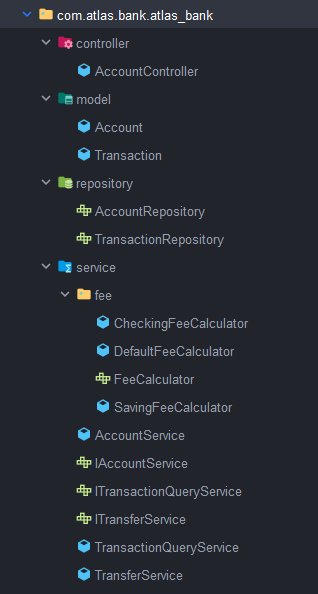 | 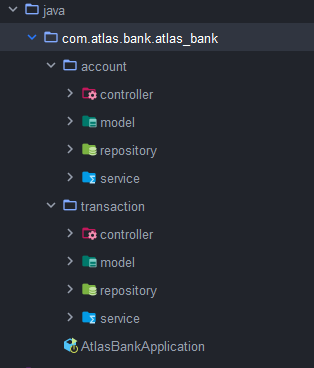 |

Estructura final del proyecto (`proyecto/src/main/java/com/atlas/bank/atlas_bank/`):

```
account/
├── controller/AccountController.java
├── model/Account.java
├── repository/AccountRepository.java
└── service/
    ├── AccountService.java
    └── IAccountService.java
transaction/
├── controller/TransactionController.java
├── model/Transaction.java
├── repository/TransactionRepository.java
└── service/
    ├── TransactionQueryService.java / ITransactionQueryService.java
    ├── TransferService.java / ITransferService.java
    └── fee/
        ├── FeeCalculator.java
        ├── DefaultFeeCalculator.java
        ├── CheckingFeeCalculator.java
        └── SavingFeeCalculator.java
```

Ventaja: cada feature (`account`, `transaction`) es autocontenida — para tocar transferencias solo se navega dentro de `transaction/`, sin saltar entre paquetes técnicos dispersos por todo el proyecto.

---

## Clase 13 — Checkpoint del proyecto

Slide: [`clase_13/slides-clase-14 (1).html`](clase_13/slides-clase-14%20%281%29.html)

**Antes (Clase 4) → Ahora (Clase 13)**

| Antes (Clase 4) | Ahora (Clase 13) |
|---|---|
| Un solo paquete plano | Package-by-feature con capas internas |
| `AccountService` con 5 responsabilidades | Services separados por responsabilidad |
| Entity directa como request y response | (se resuelve con DTOs en la Sección 2) |
| `RuntimeException` para todo | (se resuelve con `ProblemDetail` en la Sección 2) |
| `if/else` de comisiones hardcodeado | Comisiones con `FeeCalculator` (Strategy) |
| Cuentas y transacciones mezcladas | Controllers e interfaces separados por feature |
| — | Constructor injection + API versionada (`/api/v1/...`) |

Lo que se aprendió:

- **SRP**: una sola razón para cambiar
- **OCP**: extender sin modificar (`FeeCalculator`)
- **LSP**: si el hijo no cumple el contrato, no debería heredar
- **ISP**: contratos específicos → se aplica en Hexagonal
- **DIP**: depender de abstracciones → base de Hexagonal
- Constructor injection como estándar
- Package-by-feature con capas internas
- API versionada con `/v1/`

**Qué sigue (Sección 2 — Arquitectura en capas con criterio):**

- DTOs — separar lo que se expone de lo que se persiste
- `ProblemDetail` — errores con el estándar RFC 7807
- Bean Validation — validación como primera línea de defensa
- El service como orquestador, no como Dios

---

## Referencia rápida del proyecto

- Código fuente: [`/proyecto/src/main/java/com/atlas/bank/atlas_bank`](../proyecto/src/main/java/com/atlas/bank/atlas_bank)
- API: `GET/POST /api/v1/accounts`, `GET /api/v1/accounts/{id}`, `POST /api/v1/transactions/transfer`, `GET /api/v1/transactions/{id}/transactions`
- Historial de la evolución del código: `git log --oneline` sobre `/proyecto` (commits: *proyecto sin SOLID*, *Single Responsibility*, *Open Closed*, *fix service query*, *dependency inversion*, *package by layer-feature*)
